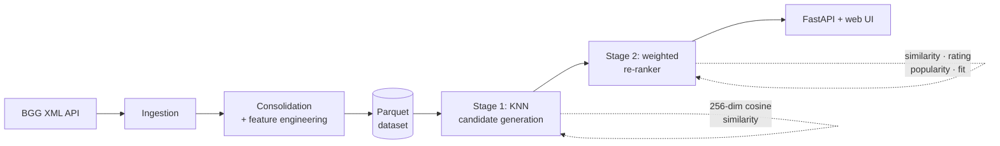
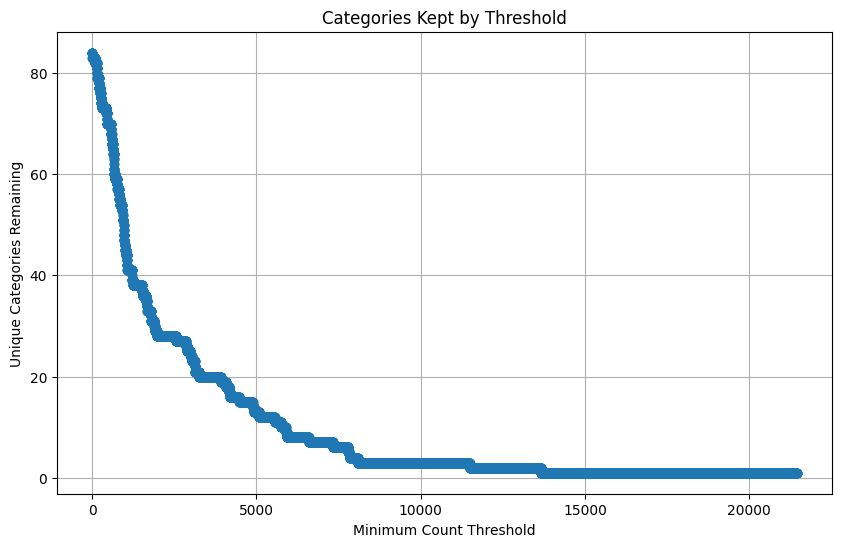
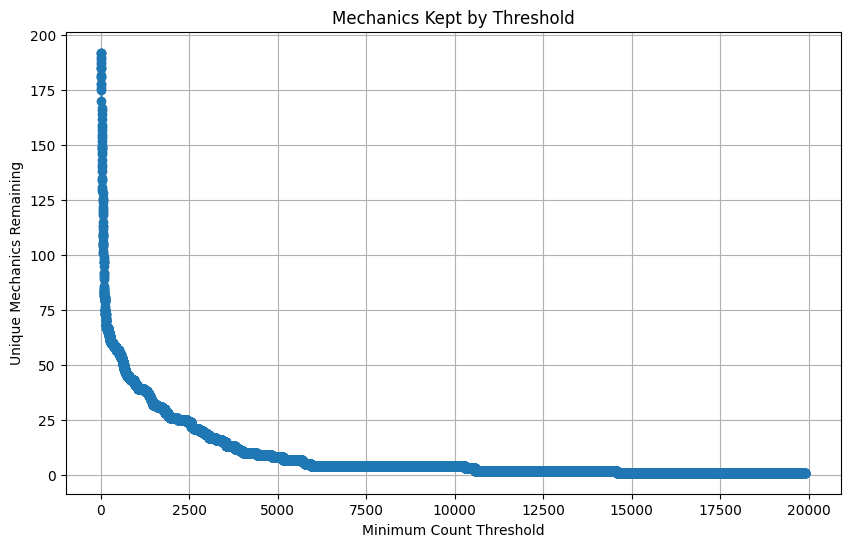
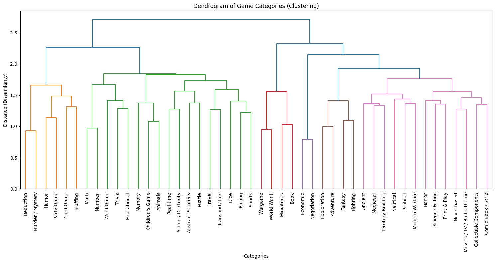
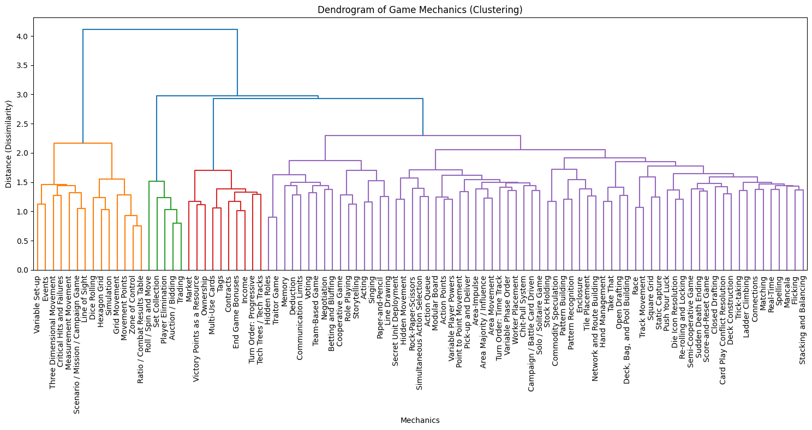

<h1 align="center">Boardom Buster</h1>

<p align="center">
  
</p>

<p align="center">
  <em>A board game recommender that finds games that are both similar to one you like <strong>and</strong> worth playing.</em>
</p>

<p align="center">
  
</p>

BoardGameGeek lists more than a hundred thousand games. Picking your next one from that pile is the problem this project tries to solve. "Show me games like *Wingspan*" is easy; the hard part is not burying a great match under a dozen obscure clones that happen to share a tag. Boardom Buster splits that into two jobs: find candidates that genuinely resemble the game you picked, then rank them by how good and how playable they actually are.

Under the hood that's a two-stage recommender. K-Nearest Neighbors is only the first stage. A weighted re-ranker does the part that decides what you actually see.

There's a longer write-up of the design and the decisions behind it on my blog: [Boardom Buster — my board game recommendation system](https://wilowsballoc.bearblog.dev/boardom-buster-my-boardgame-recommendation-system/).

## How it works



The recommendation itself runs in two stages, and keeping them separate is the whole idea.

**Stage 1 — retrieval (KNN).** Every game is turned into a 256-dimensional vector built purely from *what kind of game it is*: 63 category flags, 173 mechanic flags, and 20 player-count flags. Nearest-neighbor search over that space (cosine distance) pulls the 200 games closest to your pick. This stage answers one question only: which games play like this one? Quality and popularity don't enter into it yet.

**Stage 2 — ranking (re-ranker).** The 200 candidates get scored on five signals and sorted by a weighted sum:

| Signal | Weight | What it captures |
| --- | --- | --- |
| Cosine similarity | 0.40 | How close the candidate is in category/mechanic space |
| Rating | 0.15 | Quality, via BGG's Bayesian average (falls back to raw average) |
| Popularity | 0.15 | A blend of owned / wanted / wishlisted counts |
| Difficulty fit | 0.20 | How close the complexity is to your game |
| Playing-time fit | 0.10 | How close the session length is to your game |

Similarity gets you into the room; rating, popularity, and fit decide the order. That's why a well-loved, comparably heavy game outranks an obscure one that happens to share three tags. The weights live in config and can be overridden per request, so "I care more about quality than exact similarity" is a knob, not a rewrite.

Two more touches on top of the ranking:

- **Family de-duplication.** BGG groups reprints, editions, and spin-offs into families. The re-ranker keeps only the highest-scoring game per family, so you don't get five flavors of Catan in a five-item list. It's toggleable per request.
- **Generated explanations.** Each result set gets short plain-language notes ("This game is very similar to your game", "is the most popular recommendation") derived from which game leads on which signal. No LLM, just rules over the scores.

## Features

- Two-stage recommender: KNN candidate generation followed by a multi-signal weighted re-ranker
- Quality-aware ranking using Bayesian rating, a weighted popularity score, and difficulty/playing-time fit
- A `recommendable` flag that separates *searchable* games from *recommendable* ones, so you can seed a search with an obscure game and still get solid results back
- Family de-duplication for variety in the results
- Rule-based explanations for why each game surfaced
- Async ingestion from the BoardGameGeek XML API with retry/backoff handling
- A config-driven, composable feature-engineering pipeline (each transformation is its own class)
- FastAPI backend with a vanilla-JS frontend: fuzzy search, autocomplete, and per-game radar charts
- Docker / Docker Compose deployment, CI, pre-commit hooks, and a pytest suite across the ML, ETL, and API layers

## The data pipeline

### Ingestion (`src/etl/ingestion/bgg.py`)

The crawler walks the BGG `/thing` endpoint by ID, fetching games in configurable batches with several requests in flight at once (`httpx.AsyncClient` + `asyncio.gather`). BGG rate-limits aggressively, so 429 responses trigger a backoff that lengthens with each retry, and the crawl stops after a run of empty batches. Results stream to a dated Parquet file (LZ4-compressed) as they arrive rather than being held in memory. The four throughput knobs — batch size, concurrent requests, retry delay, max retries — are all in `settings.yaml`; tuning them against BGG's limits was most of the work here.

### Consolidation and feature engineering (`src/etl/consolidation/`)

Raw XML is messy, so the processing stage is a pipeline of small, single-purpose transformations run in sequence (`TransformationsManager` over a list of `BaseTransformation` subclasses). Adding a step means adding a class, not editing a monolith. The steps:

- **Clean** HTML entities out of descriptions and cast columns to real types.
- **Flag, don't drop.** Games below the rating-count threshold (30 ratings) stay in the dataset but get `to_recommend = 0`. They can still be the game you *search for*; they just won't be *recommended*. This is what lets a niche favorite return good matches.
- **Prune rare features.** Categories appearing in fewer than 1000 games and mechanics in fewer than 80 are dropped as noise. Those cutoffs come from the elbow analysis in the notebooks below.
- **Encode.** One-hot player counts (capped at 20), then one-hot the surviving categories and mechanics — the 256 feature columns the KNN runs on.
- **Score popularity.** A weighted combination of owned (×2.0), wanted (×1.0), and wishlisted (×0.5) counts, min-max normalized across recommendable games.
- **Normalize and clip** the numeric fields (min age, playing time clipped to a 0–360 minute range) so no single field dominates the re-ranker's distance math.

Reads and writes go through a small factory (`src/other/abstract/`) so the storage format sits behind an interface; Parquet is the current implementation.

### The analysis behind the numbers (`notebooks/`)

The thresholds and encodings above aren't guesses. The notebooks hold the exploratory work that set them:

<p align="center">
  
  
</p>

An elbow analysis of how many categories/mechanics survive at each minimum-count cutoff set the 1000 and 80 thresholds — low enough to keep signal, high enough to drop long-tail noise.

<p align="center">
  
  
</p>

I also tried merging correlated categories and mechanics with hierarchical clustering (Ward linkage on the correlation matrix, shown above). The correlations turned out too weak to justify collapsing features, so the pipeline keeps them separate and one-hot encoded. The dendrograms are here because a rejected approach is still part of the reasoning.

The `minmax_players.ipynb` and `num_ratings.ipynb` notebooks cover the player-count distribution (which set the cap of 20) and the ratings distribution (which set the recommendable threshold).

## The web app

The frontend is dependency-light on purpose: vanilla JavaScript with [Fuse.js](https://fusejs.io/) for client-side fuzzy search. On load it pulls the full game list once (`GET /games`) and does autocomplete locally, so typing feels instant. Pick a game and it posts to `/recommend`; results render as cards with the game's art, categories, mechanics, a generated comment, and a radar chart drawn on a `<canvas>` showing all five ranking signals at a glance. A toggle controls family exclusion.

The design started from a Gemini-generated mockup (`docs/mockup/`) and a set of user-journey sketches (`docs/user_journey/`).

## Project structure

```
boardom_buster/
├── config/
│   └── settings.yaml           # Single source of truth: paths, ingestion, ETL, ML params
├── data/
│   ├── raw/                    # Dated Parquet dumps from the BGG API
│   └── processed/              # Cleaned, feature-engineered datasets
├── docs/                       # Analysis plots, mockups, user-journey diagrams
├── notebooks/                  # EDA that justified the thresholds and encodings
├── src/
│   ├── config.py               # YAML + .env settings loader (pydantic-settings)
│   ├── app/                    # FastAPI application
│   │   ├── main.py             # Entry point, lifespan model loading, static serving
│   │   ├── dependencies.py     # Global recommender state + DI
│   │   ├── schemas.py          # Pydantic request/response models
│   │   └── routes/             # /recommend, /games, /ingest
│   ├── etl/
│   │   ├── ingestion/          # Async BGG crawler
│   │   └── consolidation/      # Transformation pipeline + feature engineering
│   ├── ml/
│   │   ├── knn.py              # Stage 1: candidate generation
│   │   ├── reranker.py         # Stage 2: weighted scoring + family dedup
│   │   └── recommender.py      # Orchestrates both stages, adds comments
│   └── other/abstract/         # Format-agnostic read/write (Parquet)
├── static/                     # CSS, JS, templates for the web UI
├── tests/                      # pytest suite across ml/, etl/, app/
├── Dockerfile
├── docker-compose.yml
└── pyproject.toml
```

## Tech stack

- **Python 3.12+**
- **[Polars](https://pola.rs/)** for the data pipeline (raw ingestion through feature engineering)
- **[scikit-learn](https://scikit-learn.org/)** `NearestNeighbors` for candidate retrieval
- **[FastAPI](https://fastapi.tiangolo.com/)** + **[Uvicorn](https://www.uvicorn.org/)** for the API
- **[httpx](https://www.python-httpx.org/)** + **[xmltodict](https://github.com/martinblech/xmltodict)** for async ingestion
- **[pydantic-settings](https://docs.pydantic.dev/latest/concepts/pydantic_settings/)** + **PyYAML** for config
- **Vanilla JS** + **Fuse.js** on the frontend
- **Parquet** for storage, **Docker** for deployment

## Getting started

### Prerequisites

- Python 3.12 or higher
- `pip` (or a compatible package manager)

### Local setup

```bash
git clone https://github.com/hugo-valdrez/boardom_buster.git
cd boardom_buster

python -m venv venv
source venv/bin/activate          # Windows: venv\Scripts\activate

pip install -r requirements.txt
```

The repo ships with a processed dataset under `data/processed/`, so you can run the app straight away. To build a fresh dataset instead:

```bash
python -m src.etl.ingestion.bgg          # crawl the BGG API (slow; respects rate limits)
python -m src.etl.consolidation.consolidation   # clean + feature-engineer
```

A BGG bearer token is optional. If you have one, copy `.env.example` to `.env` and set `BGG_BEARER_TOKEN`.

### Run the app

```bash
python -m src.app.main
# or:
uvicorn src.app.main:app --host 0.0.0.0 --port 8000 --reload
```

Then open <http://localhost:8000>. The recommender loads the dataset and fits the KNN model once at startup.

### Docker

```bash
docker-compose up --build
```

Compose mounts `data/` and `logs/` as volumes and serves on port 8000.

## Configuration

Everything tunable lives in `config/settings.yaml`, grouped into four blocks:

- **`paths`** — where raw data, processed data, and logs go.
- **`ingestion`** — BGG base URL, batch size, concurrency, retry delay, and the stop condition.
- **`etl`** — filter thresholds (rating count, category/mechanic minimums, playing-time bounds), the player-count cap, popularity weights, and column types.
- **`ml`** — KNN parameters (`n_neighbors`, `metric`, `algorithm`, excluded columns) and the re-ranker weights + `top_k`.

Change a weight or a threshold here and the whole pipeline picks it up; no code edits.

## API

| Method | Path | Description |
| --- | --- | --- |
| `GET` | `/` | Serves the web UI |
| `GET` | `/games` | Full game list (`id`, `name`, `thumbnail`) for client-side search |
| `POST` | `/recommend` | Recommendations for a game. Body: `game_id`, optional `weights`, `top_k`, `exclude_same_family` |
| `POST` | `/ingest` | Kicks off ingestion + consolidation + model reload in the background |

Example:

```bash
curl -X POST http://localhost:8000/recommend \
  -H "Content-Type: application/json" \
  -d '{"game_id": 266192, "top_k": 5, "exclude_same_family": true}'
```

The response carries the input game's details plus a ranked list, each item scored on all five signals with a generated comment.

> The `/ingest` route exists but is commented out in `main.py` by default, since a full crawl is a long, rate-limited job you rarely want to trigger from the web. Uncomment `app.include_router(ingest_router)` to enable it.

## Testing

```bash
pytest                                   # full suite
pytest --cov=src --cov-report=html       # with coverage
pytest tests/ml/test_reranker.py -v      # a single module
```

Tests cover the ML stages (KNN, re-ranker, recommender), the ETL transformations, and the API routes. Formatting and linting run through pre-commit (black, isort, flake8) and CI.

## Roadmap

- [ ] Feedback loop: let users say whether a recommendation landed, and why
- [ ] A mobile-friendly build of the UI
- [ ] Description-based similarity via text embeddings, as a signal alongside the categorical features
- [ ] Harden the endpoints: authentication, rate limiting, and input validation on `top_k` / `game_id`

## License

MIT. See [LICENSE](LICENSE).
