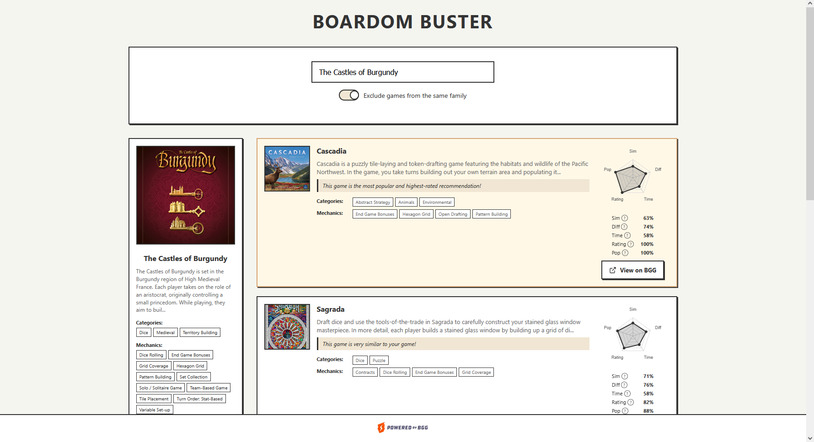

<h1 align="center">Boardom Buster</h1>

<p align="center">
  
</p>

A machine learning-based recommendation engine for board games. The system fetches data from the BoardGameGeek (BGG) API, processes it through a data pipeline with feature engineering, and uses a K-Nearest Neighbors (KNN) model to provide personalized game recommendations via a web interface.

<p align="center">
  
</p>

## Features

- Automated data ingestion from the BoardGameGeek XML API
- Data cleaning and feature engineering pipeline with Min-Max normalization
- K-Nearest Neighbors model for similarity-based recommendations
- Re-ranking system with weighted metrics for improved recommendation quality
- RESTful API built with FastAPI
- Web-based user interface for interactive recommendations
- Docker support for containerized deployment
- Comprehensive test suite

## Technical Architecture

The recommendation pipeline consists of the following stages:

```
BGG XML API --> Ingestion --> Consolidation --> KNN Model --> Re-Ranker --> Web UI
                  |               |                |             |
              Raw Data      Min-Max Scaling   Cosine Distance  Weighted
              Extraction    Feature Encoding  Similarity       Scoring
```

### Pipeline Components

1. **Ingestion**: Asynchronous fetching of board game data from the BGG API. Extracts game metadata including categories, mechanics, player counts, ratings, and more.

2. **Consolidation and Processing**:
   - Filters games based on rating thresholds and validity criteria
   - One-hot encodes categorical features (mechanics, categories)
   - Normalizes all numerical columns using Min-Max scaling
   - Computes popularity scores with configurable weights

3. **KNN Candidate Generation**: Uses scikit-learn's NearestNeighbors with cosine distance to identify similar games based on feature vectors.

4. **Re-Ranking**: Applies weighted scoring using cosine similarity and other metrics to produce final recommendations.

5. **Web Interface**: FastAPI backend serving a static frontend for user interaction.

## Directory Structure

```
boardom_buster/
├── config/                 # Configuration files
│   └── settings.yaml       # Application settings (paths, ML params, ETL config)
├── data/
│   ├── raw/                # Raw data from BGG API
│   └── processed/          # Cleaned and transformed datasets
├── docs/
│   ├── images/             # Analysis visualizations
│   ├── mockup/             # UI mockups
│   └── user_journey/       # User journey diagrams
├── logs/                   # Application and ingestion logs
├── notebooks/              # Jupyter notebooks for EDA
│   ├── categories.ipynb
│   ├── mechanics.ipynb
│   ├── minmax_players.ipynb
│   └── num_ratings.ipynb
├── src/
│   ├── config.py           # Settings loader
│   ├── app/                # FastAPI application
│   │   ├── main.py         # Application entry point
│   │   ├── dependencies.py # Dependency injection
│   │   ├── schemas.py      # Pydantic models
│   │   └── routes/         # API endpoints
│   ├── etl/
│   │   ├── ingestion/      # BGG API data fetching
│   │   └── consolidation/  # Data transformation pipeline
│   ├── ml/
│   │   ├── knn.py          # KNN candidate generator
│   │   ├── recommender.py  # High-level recommender interface
│   │   └── reranker.py     # Re-ranking logic
│   └── other/
│       └── abstract/       # I/O utilities (Parquet read/write)
├── static/
│   ├── css/                # Stylesheets
│   ├── js/                 # Frontend JavaScript
│   ├── images/             # Static images
│   └── templates/          # HTML templates
├── tests/                  # Unit and integration tests
├── docker-compose.yml      # Docker Compose configuration
├── Dockerfile              # Container build instructions
├── pyproject.toml          # Project metadata and dependencies
├── requirements.txt        # Python dependencies
└── requirements-dev.txt    # Development dependencies
```

## Installation and Setup

### Prerequisites

- Python 3.12 or higher
- pip or a compatible package manager

### Local Installation

1. Clone the repository:

```bash
git clone https://github.com/your-username/boardom_buster.git
cd boardom_buster
```

2. Create and activate a virtual environment:

```bash
python -m venv venv
source venv/bin/activate  # On Windows: venv\Scripts\activate
```

3. Install dependencies:

```bash
pip install -r requirements.txt
```

4. Run the data ingestion pipeline to fetch BGG data:

```bash
python -m src.etl.ingestion.bgg
```

5. Process the raw data through the consolidation pipeline:

```bash
python -m src.etl.consolidation.consolidation
```

### Docker Installation

Alternatively, use Docker Compose for containerized deployment:

```bash
docker-compose up --build
```

## Usage

### Starting the Application

Run the FastAPI server:

```bash
python -m src.app.main
```

Or with uvicorn directly:

```bash
uvicorn src.app.main:app --host 0.0.0.0 --port 8000 --reload
```

The web interface will be available at `http://localhost:8000`.

### API Endpoints

- `GET /`: Serves the web interface
- `GET /recommend/{game_id}`: Returns recommendations for a given game ID

### Configuration

Application settings are managed in `config/settings.yaml`. Key configuration options include:

- **Paths**: Locations for raw data, processed data, and logs
- **Ingestion**: BGG API parameters, batch sizes, retry settings
- **ETL**: Filter thresholds, player count caps, popularity score weights
- **ML**: KNN parameters (n_neighbors, metric, algorithm)

## Testing

Run the test suite using pytest:

```bash
pytest
```

Run tests with coverage reporting:

```bash
pytest --cov=src --cov-report=html
```

Run specific test modules:

```bash
pytest tests/ml/test_recommender.py -v
pytest tests/app/routes/test_recommend.py -v
```

## License

This project is licensed under the MIT License. See the [LICENSE](LICENSE) file for details.
